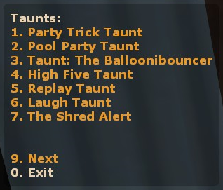

# TF2 Taunts TF2IDB 
An extensible and auto-updatable TF2 taunt menu/command plugin for sourcemod that is intended to replace plugins like [Taunt'em](https://forums.alliedmods.net/showthread.php?p=2157489) and [Random taunt menu plugins thrown around that thread](https://forums.alliedmods.net/showpost.php?p=2185997&postcount=84)

## Usage
### Demo videos 
General usage:

``sm_taunt_force`` command:

### Commands
* ``sm_taunt``/``sm_taunts``(``!taunt``/``!taunts`` from chat) If no arguments were given, it shows a taunt menu, if one argument is given it'll be interpreted as an Item Definition Index (aka taunt id). Example: ``sm_taunt 463`` Makes you taunt "Laugh Taunt", ``sm_taunt`` shows the taunt menu.
* ``sm_taunt_list``/``sm_taunts_list``(``!taunt_list``/``!taunts_list`` from chat) Shows a list of available taunts, starting with its id, then the name and lastly the class that can use it.
* ``sm_taunt_force``/``sm_taunts_force``(``!taunt_force``/``!taunts_force`` from chat) Given a target and a taunt id, it forces target to taunt.

### Example usage

 
  
Output from <code>sm_taunt_list</code>: 

<pre>
sm_taunt_list
[SM] Taunts:
- Taunts for class engineer:
-  1115: Rancho Relaxo Taunt (engineer)
-  30618: Taunt: Bucking Bronco (engineer)
- Taunts for class spy:
-  1108: Buy A Life Taunt (spy)
-  30615: Taunt: The Boxtrot (spy)
-  30762: Taunt: Disco Fever (spy)
- Taunts for class pyro:
-  1112: Party Trick Taunt (pyro)
-  30570: Pool Party Taunt (pyro)
-  30763: Taunt: The Balloonibouncer (pyro)
- Taunts for class heavy:
-  1174: Taunt: The Table Tantrum (heavy)
-  1175: Taunt: The Boiling Point (heavy)
-  30616: Taunt: The Proletariat Showof (heavy)
- Taunts for class medic:
-  477: Meet the Medic Heroic Taunt (medic)
-  1109: Results Are In Taunt (medic)
- Taunts for class demoman:
-  1114: Spent Well Spirits Taunt (demoman)
-  1120: Oblooterated Taunt (demoman)
-  30671: Taunt: True Scotsman's Call (demoman)
-  30840: Taunt: Scotsmann's Stagger (demoman)
- Taunts for class soldier:
-  1113: Fresh Brewed Victory Taunt (soldier)
-  30673: Taunt: Soldier's Requiem (soldier)
-  30761: Taunt: The Fubar Fanfare (soldier)
- Taunts for class sniper:
-  1116: I See You Taunt (sniper)
-  30609: Taunt: The Killer Solo (sniper)
-  30614: Taunt: Most Wanted (sniper)
-  30839: Taunt: Didgeridrongo (sniper)
- Taunts for class scout:
-  1117: Battin' a Thousand Taunt (scout)
-  1119: Deep Fried Desire Taunt (scout)
-  1168: Taunt: The Carlton (scout)
-  30572: Taunt: The Boston Breakdance (scout)
- All Class taunts:
-  167: High Five Taunt (All Class)
-  438: Replay Taunt (All Class)
-  463: Laugh Taunt (All Class)
-  1015: The Shred Alert (All Class)
-  1106: Square Dance Taunt (All Class)
-  1107: Flippin' Awesome Taunt (All Class)
-  1110: RPS Taunt (All Class)
-  1111: Skullcracker Taunt (All Class)
-  1118: Conga Taunt (All Class)
-  1157: Taunt: Kazotsky Kick (All Class)
-  1162: Taunt: Mannrobics (All Class)
-  1172: Taunt: The Victory Lap (All Class)
-  30621: Taunt: Burstchester (All Class)
-  30672: Taunt: Zoomin' Broom (All Class)
-  30816: Taunt: Second Rate Sorcery (All Class)
</pre>

### Tips
Using the commands listed above, you can bind a key to a specific taunt like this:
* Type ``!taunt_list`` from chat, find and write down the id for which you'd like to bind a key.
* Enter the game console and write ``bind KEY "sm_taunt id"`` replace ``KEY`` and ``id`` with their respective values, of course.

Now each time you press ``KEY`` you'll taunt to the rhythm of ``id`` 💃

## Installing

1. Make sure you have [TF2ItemsInfo](https://github.com/chauffer/tf2itemsinfo) or [TF2ItemsDB](https://forums.alliedmods.net/showthread.php?t=255885) (preferred) installed on your server.
2. You'll need the [TF2Items](https://forums.alliedmods.net/showthread.php?t=115100) extension too. You can download the latest snapshot from [here](https://builds.limetech.io/?p=tf2items).
3. __Recommended__: Install the [Updater](https://forums.alliedmods.net/showthread.php?p=1570806) plugin or check if you have it installed (`sm plugins info updater`), all releases/updates to this repo will be immediately available to the updater, including updates to gamedata files.
4. Go to the [releases](https://github.com/fakuivan/TF2-Taunts-TF2IDB/releases) section.
5. Look for the latest post and download the attached zip file that matches your installed schema API (eg. ``tf2_taunts_tf2idb-nX-tf2ii.zip`` for TF2II).
6. Drag and drop the contents of the file to your ``sourcemod`` folder.
7. Load the plugin (``sm plugins load tf2_taunts_tf2idb``) and test it using the ``sm_taunt_list`` command.

## Contributing

### Did you find a bug? Want to request a feature?

Open a new [issue](https://github.com/fakuivan/TF2-Taunts-TF2IDB/issues) and describe your request (include as much information as possible).

### Do you want to contribute to this project?

Fork the repo and issue a pull request, you help is always welcome, just make sure to be consistent with the code style and naming conventions already in place.

### About the libraries included with this project

Both ``CTauntCacheSystem`` and ``CTauntEnforcer`` (except gamedata for the latter) are meant to be modular, encapsulated methodmaps that anyone can use on their project if they want to, keep in mind that at the time of writing this, there is no documentation about them, however, most properties and methods are pretty self-explanatory.
